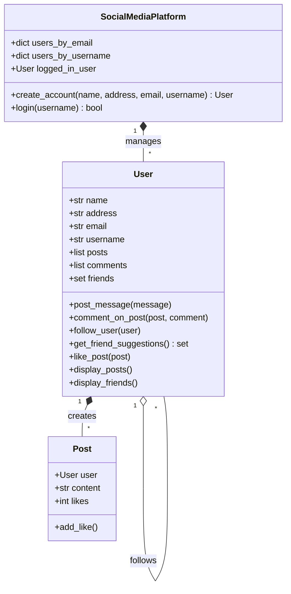

# 🌐 PySocial Graph


> **A pure Python, in-memory social media engine demonstrating Object-Oriented Design patterns, Graph-based friend recommendations, and efficient data structures.**

---

## 🚀 Overview

**PySocial Graph** is a simulation of a social media backend, built to demonstrate core Computer Science principles without the overhead of external databases or frameworks. It features a custom-built interactions graph that powers a **Friend-of-Friend Recommendation Engine**, all running in an interactive CLI environment.

This project serves as a clean, reference implementation of relationships (Followers/Following) and content distribution (Posts/Feeds) using native Python objects.

## ✨ Key Features

*   **👥 User Management System**: Complete lifecycle handling (Sign Up, Login, Authentication) using efficient dictionary lookups (`O(1)` access).
*   **🕸️ Graph-Based Connections**: Implements a directional graph for user relationships (Following/Followers).
*   **🔍 Smart Recommendation Engine**: Algorithms that traverse the social graph to suggest connections based on mutual friends (`Friend-of-Friend` logic).
*   **💬 Interactive Feed**: Real-time posting, commenting, and liking system simulating a live production environment.
*   **⚡ Optimized Performance**: Uses Sets for relationship storage to ensure unique connections and `O(1)` membership testing.

## 🛠️ Tech Stack

| Component | Technology | Description |
| :--- | :--- | :--- |
| **Language** | Python 3.x | Core logic and object definitions. |
| **Data Structures** | Lists, Sets, Dicts | Optimized in-memory storage. |
| **Architecture** | OOP / Modular | Modular design with separate classes for `User`, `Post`, and `Platform`. |

## 🏗️ Architecture

The system is built on a modular Object-Oriented architecture.



## 🚀 Getting Started

### Prerequisites
*   Python 3.8 or higher installed on your machine.

### Installation

1.  **Clone the Repository**
    ```bash
    git clone https://github.com/yourusername/social-media-platform.git
    cd social-media-platform
    ```

2.  **Run the Application**
    ```bash
    python social_media_platform.py
    ```

## 🎮 Usage Example

Interact with the specific scenarios directly in your terminal:

```text
Welcome to the Social Media Platform!
1. Create Account
2. Login
3. Exit
Enter your choice: 1

> Creating Account...
Enter your name: Alice
Enter email: alice@example.com
Username: ali_c

> Logging In...
Welcome, Alice!

User Options:
1. Create a Post
2. See Other Posts
3. Follow a User
4. See Friend Suggestions
...
```

## 📂 Project Structure

```bash
.
├── social_media_platform.py  # Entry point & Controller (Main Loop)
├── user.py                   # User Class (Attributes, Graph Traversal methods)
├── post.py                   # Post Class (Content, Likes logic)
└── README.md                 # Documentation
```

## 🔮 Roadmap

*   [ ] Persistent Storage (SQLite integration).
*   [ ] REST API wrapping (using Flask/FastAPI).
*   [ ] Advanced Graph Algorithms (Shortest path to user).
*   [ ] Unit Tests suite.

---
*Maintained by Sukesh. Open for contributions!*
